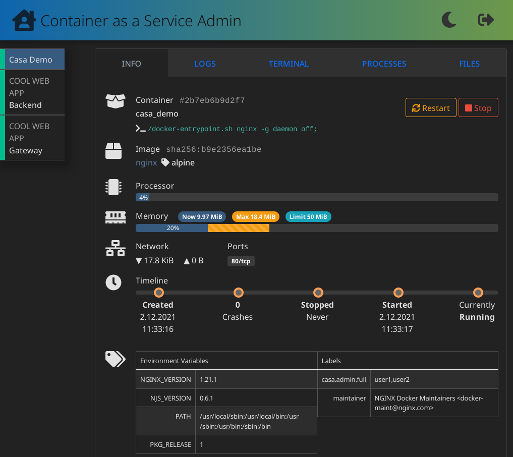

# CaaSa

## Container as a Service admin

| [Demo](https://knrdl.github.io/caasa/) | [Docker Hub](https://hub.docker.com/r/knrdl/caasa) [](https://hub.docker.com/r/knrdl/caasa) | [](https://github.com/knrdl/caasa/actions/workflows/docker-image.yml)
|----------------------------------------|-----------------------------------------------------------------------------------------------------------------------------------------------------------------------------------------------| ----------- |

Outsource the administration of a handful of containers to your co-workers.

CaaSa provides a simple web-interface to handle basic container admin tasks:

* View resource consumption/runtime behaviour
* Restart, Stop containers
* View logs and process tree
* Execute terminal commands
* Browse filesystem, upload/download files

Restrict permissions per container and user

## Getting started

### 1. Deploy CaaSa

```yaml
version: '2.4'
services:
  caasa:
    image: knrdl/caasa  # or: ghcr.io/knrdl/caasa
    restart: always
    environment:
      ROLES_caasa_admin_basic: info, state, logs, procs, files, files-read
      ROLES_caasa_admin_full: info, info-annotations, state, logs, term, procs, files, files-read, files-write
      AUTH_API_URL: https://identity.mycompany.com/login
      AUTH_API_FIELD_USERNAME: username
      AUTH_API_FIELD_PASSWORD: password
    ports:
      - "8080:8080"
    volumes:
      - /var/run/docker.sock:/var/run/docker.sock  # for Docker
      # - /run/user/1000/podman/podman.sock:/var/run/docker.sock  # for Podman
    mem_limit: 150m
    cpu_count: 1
```

> :warning: **For production** is a reverse-proxy with TLS termination in front of CaaSa highly recommended

Roles are defined via environment variables and might contain these permissions:

* **info**: display basic container metadata
* **info-annotations**: display environment variables and container labels (may contain secrets)
* **state**: allow start, stop, restart container
* **logs**: display container terminal output
* **term**: spawn (root privileged) terminal inside container
* **procs**: display running processes
* **files**: list files and directories in container
* **files-read**: user can download files from container
* **files-write**: user can upload files to container

### 2. Authentication

There are 3 methods available:

#### 2.1 Dummy authentication

Set the environment variable `AUTH_API_URL=https://wikipedia.org` (or any other server which responds with *200 OK* to a *HTTP POST* request).

 Now you can log in with **any** username and password combination.

> :warning: Only useful for tests and demos. Not suitable for productive usage.

#### 2.2 WebForm authentication

To perform logins CaaSa sends *HTTP POST* requests to the URL defined in the environment variable `AUTH_API_URL`. The requests contain a json body with username and password. The json field names are defined via environment variables `AUTH_API_FIELD_USERNAME` (default: *username*) and `AUTH_API_FIELD_PASSWORD` (default: *password*). A 2XX response code (e.g. *200 OK*) represents a successful login.

#### 2.3 WebProxy authentication

CaaSa can read the username from a HTTP request header. This header must be supplied by a reverse proxy in front of CaaSa. It can be specified via the environment variable `WEBPROXY_AUTH_HEADER`. A typical header name is *Remote-User*.

> :warning: The header must be supplied by the reverse proxy. A value provided by a malicious client must be overwritten.

### 3. Annotate containers

If a container should be visible in CaaSa, it must be annotated with a label defined above as `ROLES_<labelname>` and list all permitted usernames (or user IDs). Usernames are treated as case-insensitive.

```bash
docker run -it --rm --name caasa_demo --label caasa.admin.full=user1,user2 nginx:alpine
```

In this example the users `user1` and `user2` are granted the rights of the `caasa.admin.full` role for the container `caasa_demo` via CaaSa web interface.

## Screenshot


